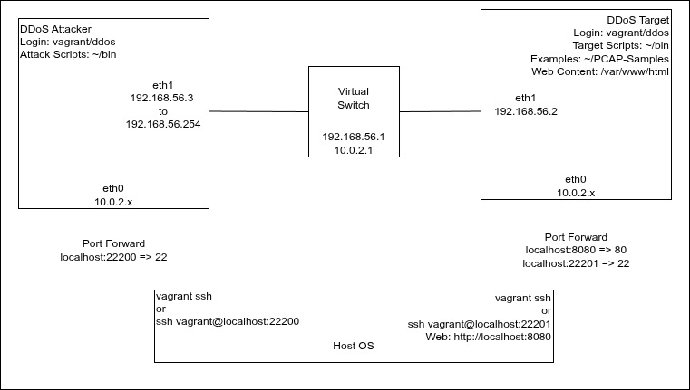

# The-DDoS-Workshop
Resources for our DDoS workshop

## Setting Up

### Set up an Environment
Install VirtualBox https://www.virtualbox.org/
Install Vagrant https://developer.hashicorp.com/vagrant/docs/installation

### Clone this project
`git clone https://github.com/rybolov/The-DDoS-Workshop.git`

### Make the Virtual Machines

Linux: From a command line, run `bash ./setup.sh`  
Windows: From a command line, run `setup.bat`

## Log in to Virtual Machines
Username: `vagrant` Password:`ddos`  

You can log into the attacker with:  
`cd VirtualMachines/DDoSAttacker`  
`vagrant ssh`  
or  
`ssh vagrant@localhost:22200`

You can log into the target with:  
`cd VirtualMachines/DDoSTarget`  
`vagrant ssh`  
or  
`ssh vagrant@localhost:22201`  
or  
Log in via the GUI

Sudo works in each machine.

## Testing Your Setup

Each VM should have a NAT interface on a network such as 10.0.2.0/24.
DDoS Target will have a single interface on a host-only adapter as 192.168.56.2. There should be a simple website on that IP address.

DDoS Attacker will have a single interface on a host-only adapter as 192.168.56.3 plus aliases on that interface from 192.168.56.4 to 192.168.56.254. This gives us a lot of IP addresses that we can launch attacks from. However, a lot of tools don't allow us to pick a source IP address.

# Launch Some Attacks!!!
Scripts are in /home/vagrant/bin on the DDoS Attacker  
`ddos-*` These scripts can be used to launch an attack  
* `ddos-pingflood-2min.sh`: ICMP Flood with large packets for 2 minutes  
* `ddos-siege-2min.sh`: HTTP GET Flood for 2 minutes  
* `ddos-siege-5min.sh`: HTTP GET Flood for 5 minutes  
* `ddos-slowloris-5min.sh`: HTTP Session Consumption (Slowloris) for 5 minutes  

`monitor-*` These scripts can be used to monitor the availability of the target website
* `monitor-curl-single.sh`: Make one HTTP Get to test availability  
* `monitor-siege-10s.sh`: HTTP GET monitoring for 10 seconds  

# Monitor Your Target
eth1 is the "Internet" interface.
* `tail -f /var/log/apache2/access.log`: watch web requests come in
* `sudo iptraf`: get a "graphical" display of network traffic
* `nload eth1`: get a top-style "graphical" display of network traffic
* `monitor-curl-single.sh`: Make one HTTP Get to test availability
* `tcpdump -i eth1`: Get a stream of packets in the console
* `tcpdump -i eth1 -w <filename.pcap>`: save a traffic sample to disk.
* In your browser: http://localhost:8080

# Analyze PCAPs
There are traffic samples in /PCAP-Samples both inside the git repo and on DDoSTarget
* DDoSTarget has Wireshark and tcpdump installed on it.
* `tcpdump -i eth1 -w <filename.pcap>`: save a traffic sample to disk on DDoSTarget and download it to your host machine.
* You can use Wireshark on your host machine.

Wireshark filters:  
* `icmp`
* `tcp`
* `tcp.port == 80`
